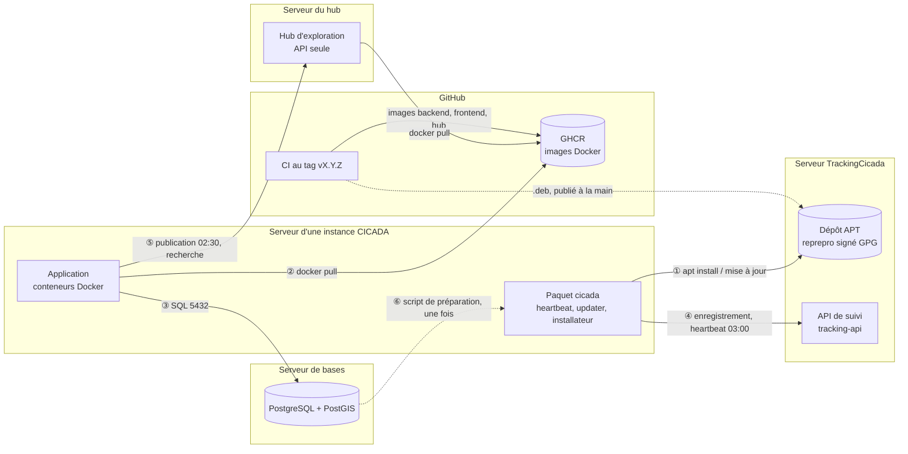
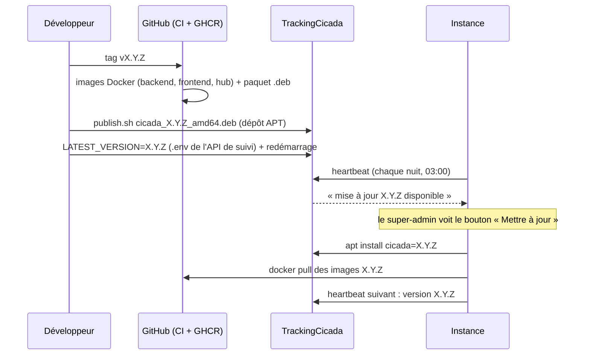

# Infrastructure CICADA : qui parle à qui

Vue d'ensemble des serveurs autour d'une instance CICADA et des liens entre eux :
ce qu'il faut ouvrir, configurer et vérifier pour que l'installation, le suivi,
les mises à jour et l'exploration fédérée fonctionnent.

Cette infrastructure est reproduite à l'identique en local par le banc de test
(`packaging/vm-bench/`, scénario `a-z` et `labo.sh`) : toute modification d'un
lien décrit ici doit y être rejouée avant d'aller en production.

## Schéma



**Toutes les flèches partent de l'instance.** Aucun serveur central n'a besoin de
joindre une instance : elle peut être derrière un pare-feu sans adresse publique.
Seule exception, ponctuelle : le serveur de bases récupère son script de
préparation auprès de l'installateur (⑥), le temps de l'installation.

## Les liens, un par un

| # | De → vers | Port | Quand | Configuré par | Si le lien est coupé |
|---|---|---|---|---|---|
| ① | Instance → dépôt APT (`apt.cicada.reserves-naturelles.org`) | 443 | installation, mise à jour | `/etc/apt/sources.list.d/cicada.list` + clé publique (guide, étape 1) | ni installation ni mise à jour par `apt` ; le bouton « Mettre à jour » échoue. Repli : `dpkg -i` du `.deb` |
| ② | Instance → GHCR (`ghcr.io`) | 443 | installation, mise à jour | rien (images publiques) | les conteneurs ne peuvent pas être téléchargés |
| ③ | Instance → serveur de bases | 5432 | en permanence | formulaire d'installation ; côté base : `cicada-prepare-db --client <ip>` (une ligne `pg_hba.conf`) | l'application ne démarre pas |
| ④ | Instance → API de suivi (`tracking.cicada.reserves-naturelles.org/api`) | 443 | à l'installation, puis chaque nuit vers 03:00 | URL gravée dans le paquet à sa construction (`/etc/cicada/cicada.conf`) ; jeton dans `/etc/cicada/instance_token` | l'instance fonctionne, mais n'apparaît plus dans le suivi et n'est plus prévenue des mises à jour |
| ⑤ | Instance → hub | 443 | publication chaque nuit à 02:30 ; recherche à chaque exploration si le relais est actif | section « Exploration fédérée » du formulaire (`CICADA_HUB_*` dans `/var/lib/cicada/.env`) + case « partage » dans Administration → Paramètres | rien n'est publié ; avec le relais actif, l'exploration répond 502 |
| ⑥ | Serveur de bases → installateur de l'instance | 4567 | une fois, à l'installation | commande affichée par le formulaire | copier le script à la main (guide, étape 3) |
| — | Navigateur de l'opérateur → installateur | 4567 | à l'installation | — | pas de formulaire (tunnel SSH possible) |
| — | Navigateurs → Apache de l'instance → frontend | 443 → 8080 | en permanence | vhost : tout vers `127.0.0.1:8080`, **jamais** `/api` vers 8000 (#231) | application inaccessible |

À la première installation, le serveur a aussi besoin de `download.docker.com` (dépôt Docker).

## Le cycle d'une release



Les **trois** gestes manuels d'une release : le tag, la publication du `.deb`
dans le dépôt, `LATEST_VERSION` sur l'API de suivi. Oublier le deuxième fait
échouer le bouton « Mettre à jour » ; oublier le troisième fait que personne
n'est prévenu. Détail : [RELEASE_PROCEDURE.md](RELEASE_PROCEDURE.md).

## Où est quoi

| Serveur | Rôle | Fichiers et commandes clés | Documentation |
|---|---|---|---|
| **TrackingCicada** | dépôt APT | `/var/www/repos/cicada` ; `packaging/apt-repo/init-repo.sh` (une fois), `publish.sh` (à chaque release) | [RELEASE_PROCEDURE.md](RELEASE_PROCEDURE.md) §4 |
| | API de suivi | `/opt/tracking-api`, son `.env` (`LATEST_VERSION`), service `cicada-tracking-api`, admin sur `/admin/` | `tracking-api/INSTALLATION.md` |
| **Hub** | recherche transverse | `/opt/cicada-hub`, `.env.hub.prod`, `enroler_instance <id>` (délivre les 2 jetons) | [DEPLOIEMENT_HUB.md](DEPLOIEMENT_HUB.md) |
| **Serveur de bases** | PostgreSQL + PostGIS | `cicada-prepare-db --client <ip-instance>` | [INSTALLATION_GUIDE.md](INSTALLATION_GUIDE.md) étape 3 |
| **Instance** | l'application | `/var/lib/cicada/.env` (configuration, root seul), `/etc/cicada/` (jeton, URL de suivi), `/var/log/cicada/` (`heartbeat.log`, `updater.log`), `/var/lib/cicada/updates/` (échange avec le bouton « Mettre à jour ») | [INSTALLATION_GUIDE.md](INSTALLATION_GUIDE.md) |

## Vérifier que tout est relié

Sur une instance :

```bash
systemctl is-active cicada-heartbeat.timer cicada-updater.path   # active, active
sudo systemctl start cicada-heartbeat && tail -2 /var/log/cicada/heartbeat.log   # ④ « Heartbeat envoyé »
apt-cache policy cicada                                          # ① le dépôt propose une version
sudo docker exec cicada_prod_web python manage.py push_federation --dry-run   # ⑤ plans publiables
curl -sI https://<domaine>/api/health/ | grep -i x-correlation-id # vhost : l'API est bien celle de CICADA
```

Sur TrackingCicada : l'instance apparaît dans `/admin/` avec sa version et un
heartbeat de la nuit ; `reprepro -b /var/www/repos/cicada list stable` donne la
dernière version.

Sur le hub : `GET /api/federation/instances/` (jeton de lecture) liste
l'instance, sa dernière publication et son nombre de plans.

## Tester avant de toucher à la production

```bash
cd packaging/vm-bench
./bench.sh run a-z      # les 4 serveurs en VM, tous les liens ci-dessus, bilan OK/KO (~25 min)
./labo.sh demarrer      # la même infrastructure, laissée allumée pour jouer une release
```

Voir [packaging/vm-bench/README.md](../packaging/vm-bench/README.md).
